## NextFire Blog

Social blogging community build with React, Next.js, and Firebase

- 👨‍🎤 Custom Firebase usernames
- 📰 Bot-friendly content (SEO)
- 🦾 Advanced SSR, SSG, and ISR techniques
- 🔥 Firestore CRUD and data modeling
- ⚛️ Reactive forms with react-hook-form
- 📂 Image file uploads
- 💞 Realtime hearts
- 🚀 Security & Deployment

## Firebase

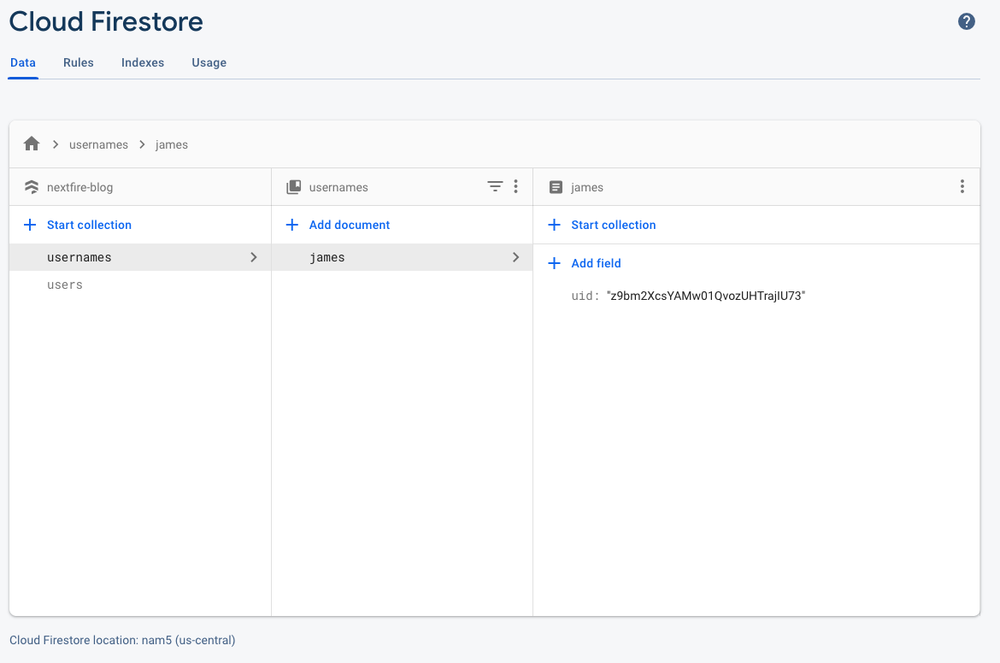
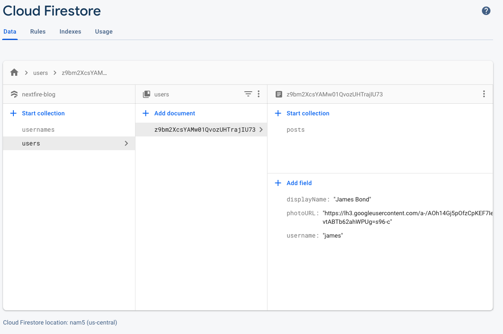
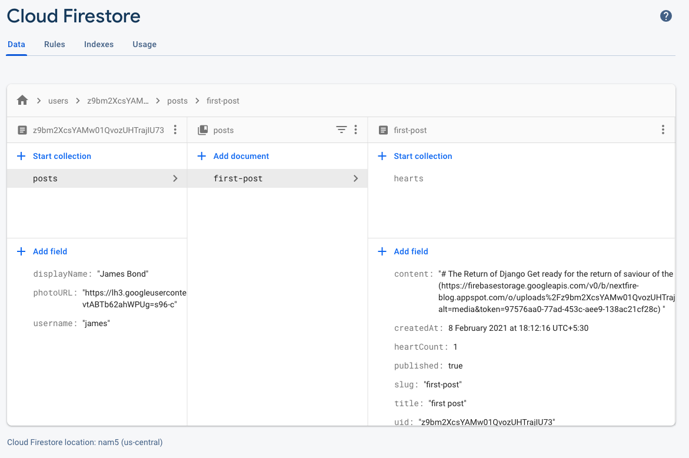
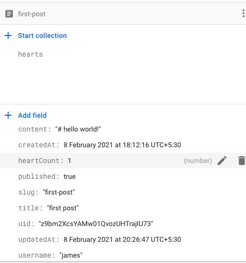
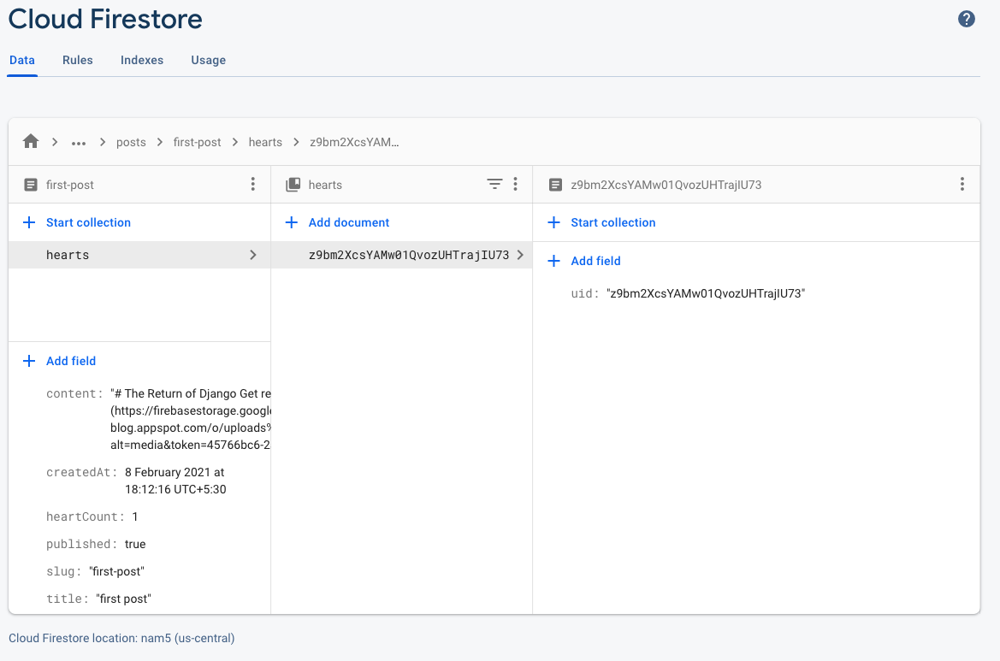
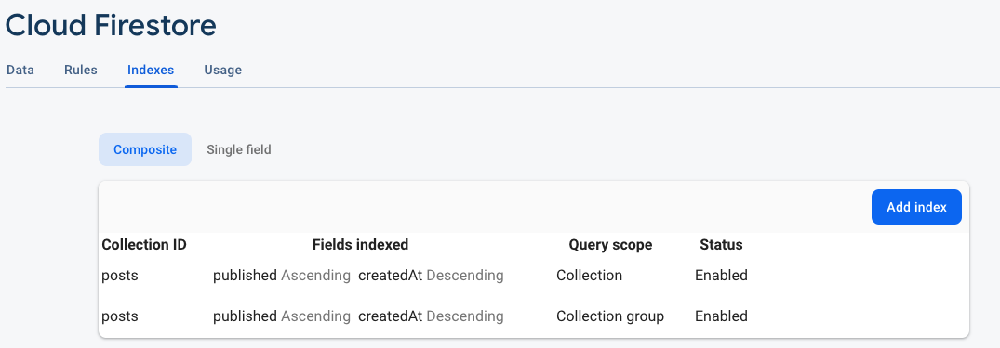
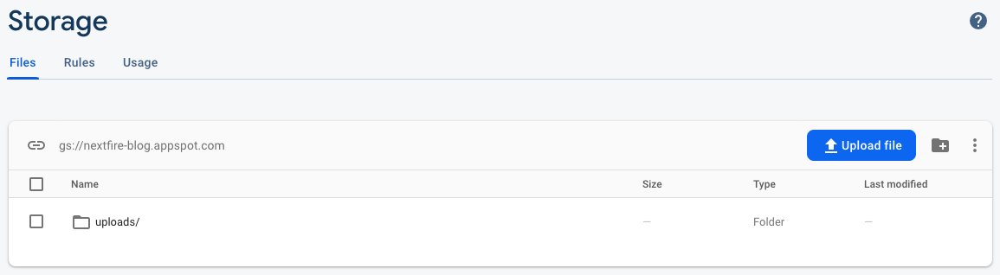
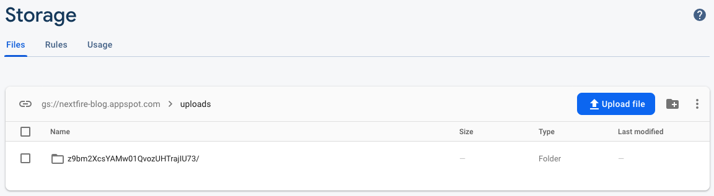
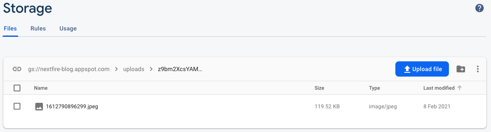

## Output

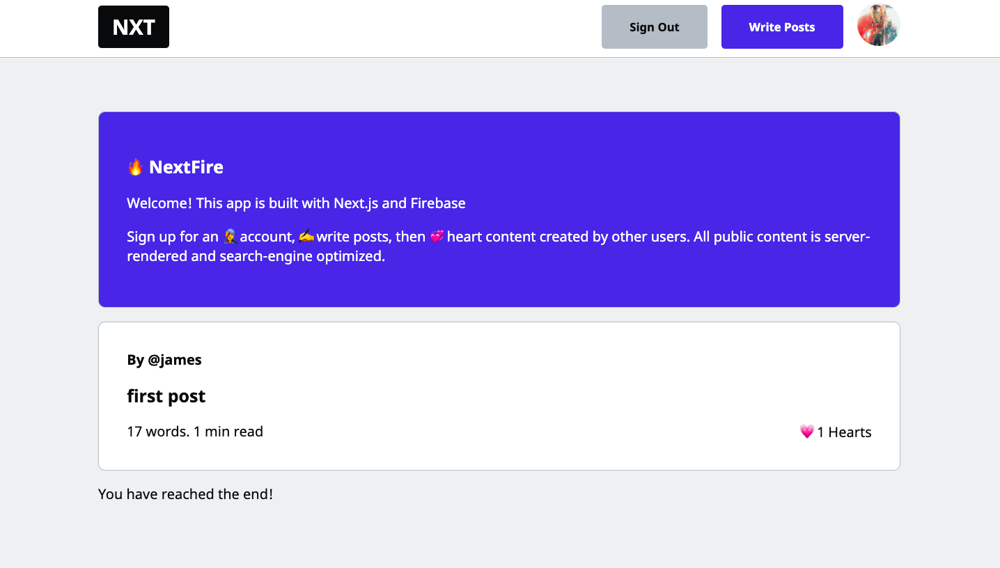

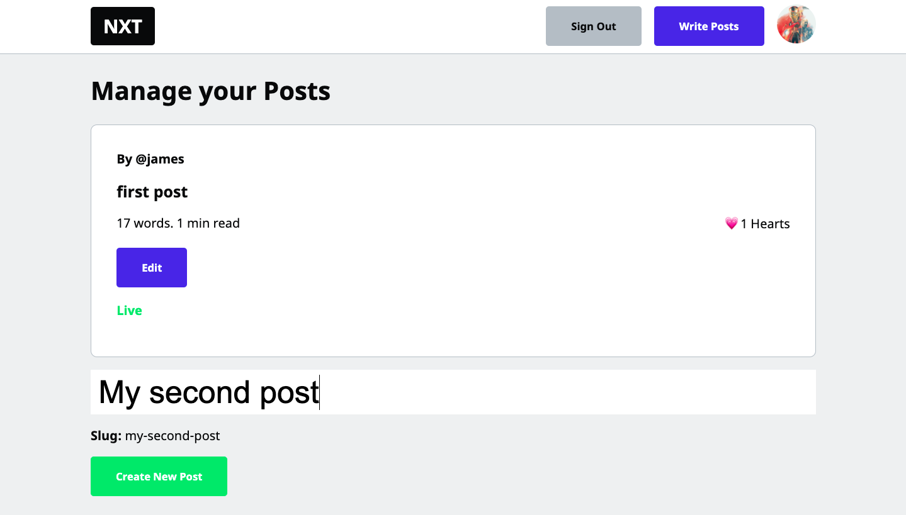
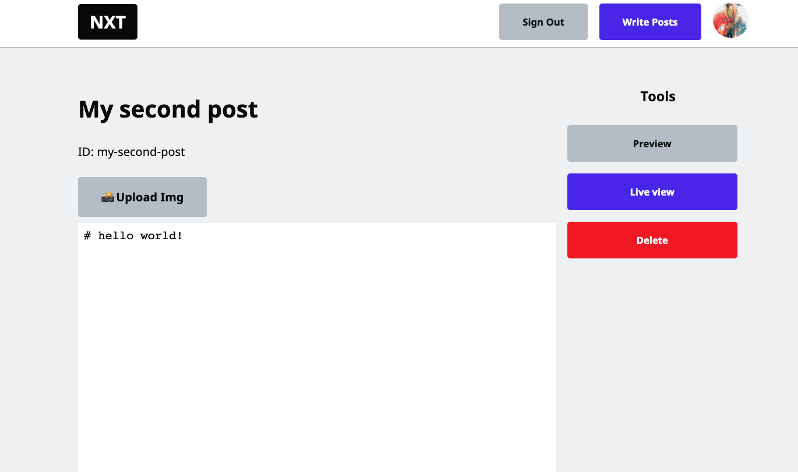
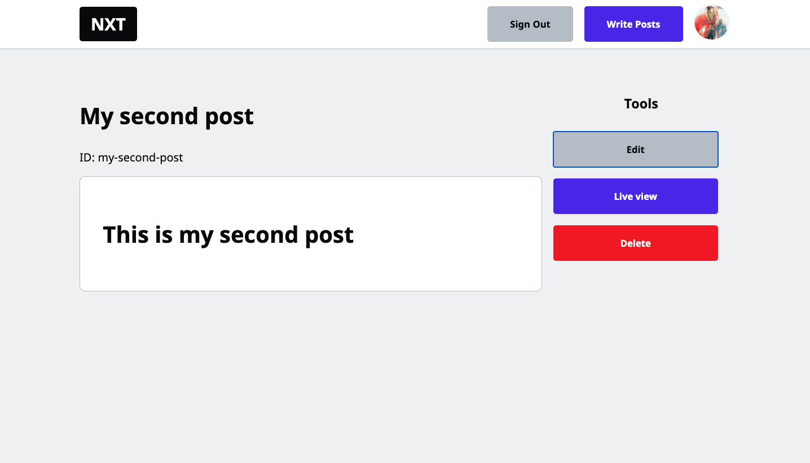
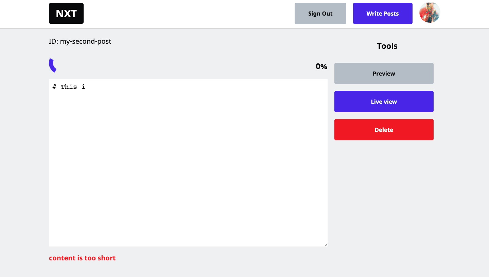
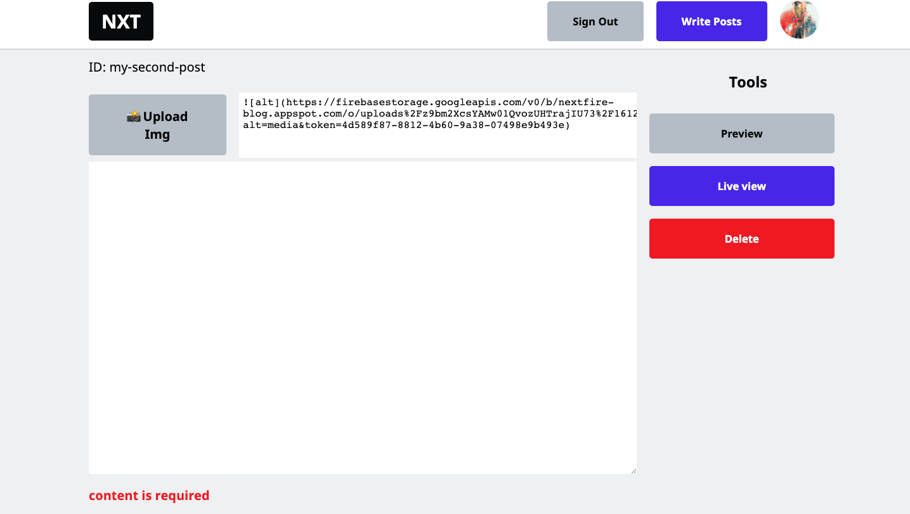
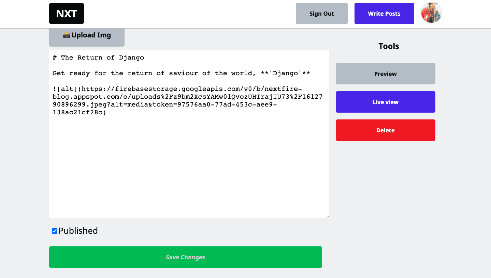
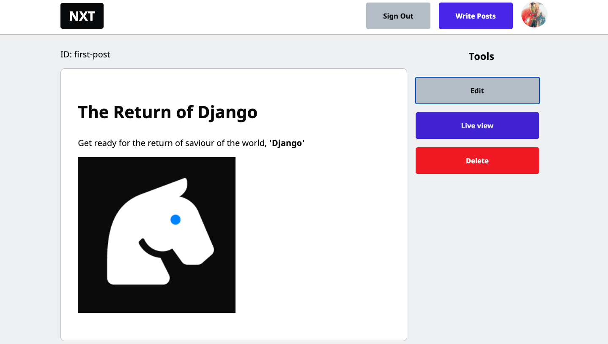
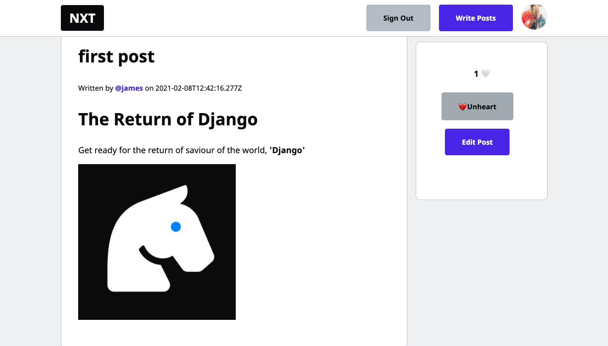
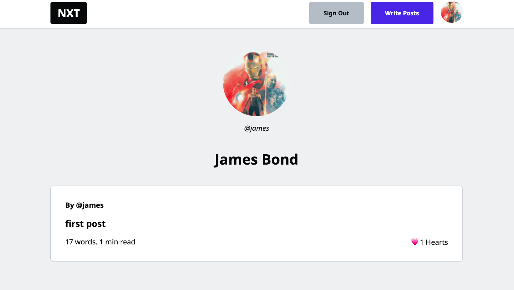
